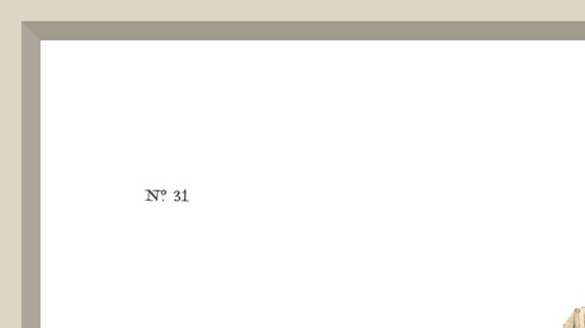

# BirdFrame

Puts the matching Audubon plate on a TV when BirdNET-Go hears a bird. Fullscreen,
no text, no UI. Two portrait plates hang as a pair; a landscape plate fills the
mat alone.


## Run it

The image is published to GHCR and is public, so nothing needs authenticating.
Only released versions are published — there is no `:latest`, so pick a version
from [releases](https://github.com/twhalm/bird-frame/releases):

```bash
docker run -d --name birdframe -p 8088:8088 \
  -v birdframe-cache:/cache \
  -e PORT=8088 \
  -e BIRDNET_URL=http://birdnet-go:8080 \
  ghcr.io/twhalm/bird-frame:1.0.0
```

Or as a compose stack — this is the whole thing, and works as-is in Portainer
(Stacks -> Add stack -> Web editor):

```yaml
services:
  birdframe:
    image: ghcr.io/twhalm/bird-frame:1.0.0
    container_name: birdframe
    restart: unless-stopped
    ports:
      - "8088:8088"
    environment:
      - PORT=8088
      - BIRDNET_URL=http://birdnet-go:8080
      - TZ=America/Los_Angeles
    volumes:
      - birdframe-cache:/cache

volumes:
  birdframe-cache:
```

Add any of the settings below to `environment` as you need them. If BirdNET-Go
runs in a different stack, either use its host IP in `BIRDNET_URL` or attach this
service to its network so the container name resolves.

Open `http://<docker-host>:8088` and press F11. Press `d` on the page to seed
demo birds without waiting for a real detection.

Set `BIRDNET_URL` to your BirdNET-Go address. That is the only setting that
matters.

## Settings

| Variable | Default | Notes |
|---|---|---|
| `BIRDNET_URL` | *(empty)* | BirdNET-Go base URL. Empty means webhook-only. |
| `POLL_SECONDS` | `60` | How often to check for detections. |
| `POLL_LIMIT` | `15` | Detections requested per poll. |
| `MIN_CONFIDENCE` | `0.65` | Ignore anything less confident. A detection with no confidence field is also ignored. |
| `HISTORY_SIZE` | `40` | How many detections stay in rotation. |
| `WEBHOOK_TOKEN` | *(unset)* | Shared secret for `POST /webhook` and `POST /api/demo`. Unset leaves both open. |
| `CACHE_DIR` | `/cache` | Where plates and history are cached. |
| `CA_BUNDLE` | *(unset)* | PEM for a TLS-inspecting proxy's CA, if you need one. |
| `VERIFY_TLS` | `true` | Set `false` to skip certificate verification for plate downloads. Last resort — prefer `CA_BUNDLE`. |
| `PORT` | `8080` | Port inside the container. BirdNET-Go usually holds 8080, so the examples above use 8088. Publish the same port you set. |
| `LOG_LEVEL` | `INFO` | |
| `DEV` | `false` | Re-read the template on every request. Costs a stat per hit; development only. |
| `BIRDFRAME_VERSION` | `dev` | Set by the release build from the git tag, and reported by `/healthz`. Leave alone. |

URL options: `?rotate=150&poll=20` (seconds), `?light=-35,40` (bevel light
azimuth and elevation, in degrees), and `?token=...` if you set `WEBHOOK_TOKEN`
and want the `d` key to work.

## Why it polls instead of using webhooks

BirdNET-Go only fires detection webhooks for new species. `detection_consumer.go`
returns early unless `event.IsNewSpecies()`, so a webhook-only setup shows a
cardinal once and then sits still for months. BirdFrame polls
`/api/v2/detections/recent` instead, which needs no auth and returns everything.

`POST /webhook` still works if you want first-of-year alerts. It reads
`scientific_name`, `species`, `confidence` and `timestamp` from either the top
level or `metadata`, and takes confidence as `0.93` or `93`.

## Species matching

Audubon named these birds in the 1830s, so only about 32% of plate names match a
modern eBird name. Fuzzy matching was tried and produces wrong birds:
"Golden-winged Woodpecker" is a Northern Flicker but fuzzy-matches Golden-naped
Woodpecker, and Wikipedia sends "Le petit caporal" to Napoleon.

So there is no guessing. `src/birdframe/data/curated_map.json` holds 217
hand-verified mappings keyed by scientific name, which is what BirdNET-Go sends.
Unmatched species are skipped rather than approximated. To add one:

```json
"Sitta carolinensis": { "plate": 152, "audubon": "White-breasted Black-capped Nuthatch" }
```

Repeated plate numbers are fine. Audubon often drew several species on one sheet.

`/healthz` lists the species it had no plate for under `unmatched_species` —
those are the ones worth adding.

## The mat

Rag board is one colour throughout, so the bevel is board colour under different
light, not a white core. Each of the four faces is flat, so each gets one flat
tone from Lambertian shading of its normal. The cut flares toward the viewer, so
light from above leaves the top face darkest and the bottom face brightest. The
corners are real 45 degree mitres. The board is flush with the print, so nothing
casts a shadow onto the art.



## Art source

The 435 plates of *The Birds of America*, from
[nathanbuchar/audubon-bird-plates-for-supernote](https://github.com/nathanbuchar/audubon-bird-plates-for-supernote)
— the same plates downsized so the smallest dimension is 2000px, which is enough
for a 4K screen at a quarter of the bytes. Plates are fetched on first sighting of
a species and cached in the `/cache` volume, so the container image stays around
150MB and disk only grows with birds you actually get. All 435 would be about
490MB. The `download` URLs inside the upstream `data.json` are dead, so BirdFrame
fetches from the repo itself.

Public domain. Credit: Courtesy of the John James Audubon Center at Mill Grove,
Montgomery County Audubon Collection, and Zebra Publishing.

## Layout

```
src/birdframe/config.py    settings, read from the environment once
src/birdframe/plates.py    plate resolution, lazy fetch and cache
src/birdframe/payload.py   parsing the shapes BirdNET-Go sends
src/birdframe/gallery.py   rotation, history, stats, disk mirror
src/birdframe/poller.py    the BirdNET-Go poller
src/birdframe/app.py       create_app() and the routes
src/birdframe/wsgi.py      gunicorn entrypoint
src/birdframe/data/        plates.json, curated_map.json
src/birdframe/web/         frame.html, the display
tests/                     pytest suite
```

Endpoints: `/`, `/api/current`, `/plate/<n>`, `/webhook`, `/api/demo`, `/healthz`.

`/healthz` returns 503 when the poller has gone three cycles without a success, so
the container healthcheck notices a BirdNET-Go outage instead of reporting healthy
while the wall goes stale. In webhook-only mode there is no poller to be unhealthy
about and it always returns 200.

History is mirrored to the cache volume so a restart brings the plates back.
Runs as one gunicorn worker on purpose, since the rotation and poller live in
process memory.

## Development

Uses [uv](https://docs.astral.sh/uv/).

```bash
uv sync                       # create .venv and install everything
uv run python -m birdframe    # http://localhost:8080, CACHE_DIR=.localcache
uv run pytest                 # tests
uv run ruff format .          # format
uv run ruff check --fix .     # lint
uv run mypy                   # typecheck (strict)
```

Local run without a container:

```bash
CACHE_DIR=.localcache DEV=true uv run python -m birdframe
```

## License

MIT, see [LICENSE](LICENSE). The plate images are public domain and are not
covered by it.
